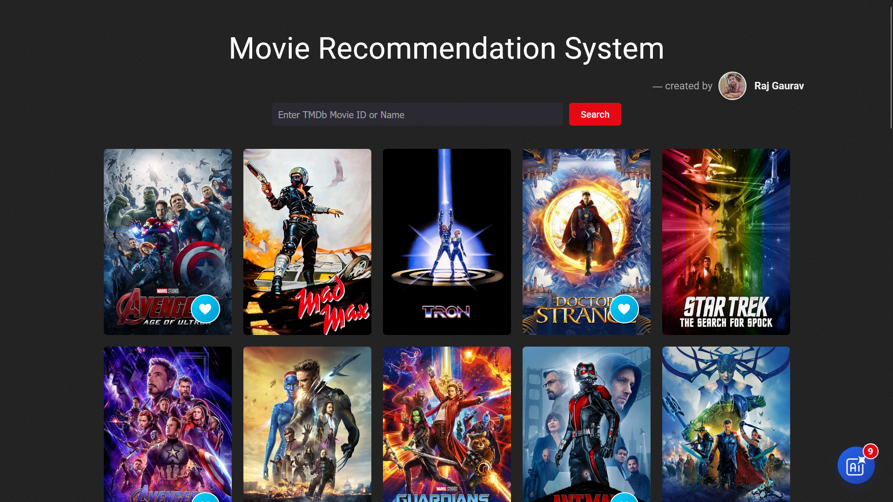
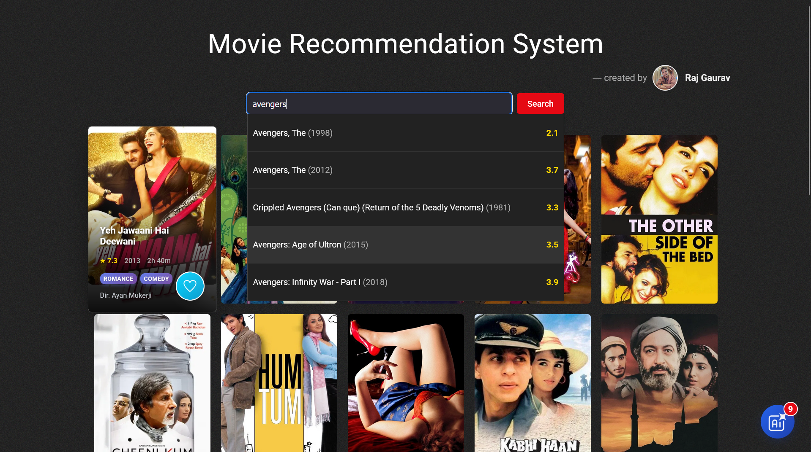
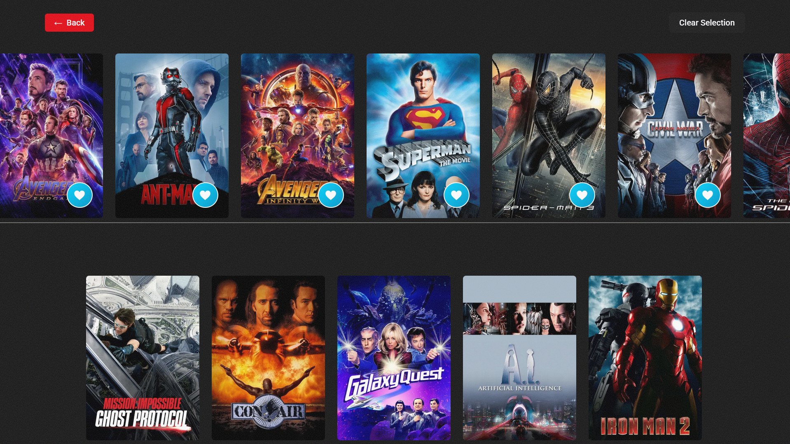
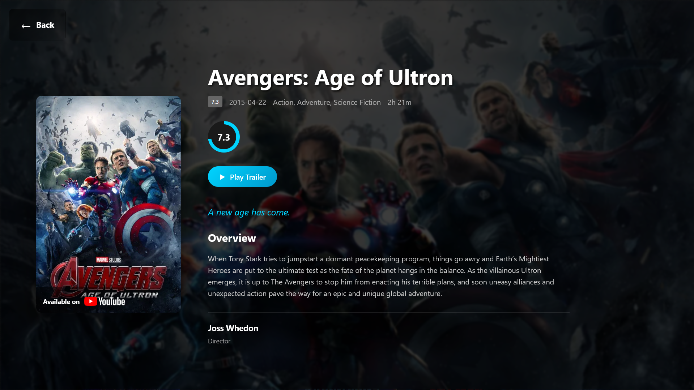

# Movie Recommendation System 🎬

A full-stack AI-powered movie recommendation system with a modern React (Vite) frontend and a FastAPI backend. Get personalized movie suggestions, search by name, view details, and like movies to improve your recommendations!
---

<p align="center">
	<table>
		<tr>
			<td></td>
			<td></td>
		</tr>
		<tr>
			<td></td>
			<td></td>
		</tr>
	</table>
</p>

---

## Features

- 🔍 **Search** for movies by name with instant suggestions.
- 🃏 **Random & AI-based recommendations** on the home page.
- 🖼️ **Movie cards** with posters, genres, director, rating, and more.
- ❤️ **Like/unlike movies** and see your liked list.
- 🤖 **AI Suggested Content** page: see recommendations based on your likes.
- 🔄 **Infinite scroll** for endless movie discovery.
- 🎥 **Popup details** for every movie.
- 🌙 **Modern, responsive, dark-themed UI**.

---

## Tech Stack

- **Frontend:** React (Vite), CSS Modules
- **Backend:** FastAPI, Python, Pandas, scikit-learn
- **Model:** Custom similarity model using TMDb IDs
- **Deployment:** Vercel (frontend), Railway (backend)

---

## Getting Started

### 1. Clone the repository

```bash
git clone https://github.com/your-username/movie-recommendation-system.git
cd movie-recommendation-system
```

### 2. Backend Setup (FastAPI)

```bash
cd backend
pip install -r requirements.txt
uvicorn main:app --host 0.0.0.0 --port 8000
```

- Make sure you have your TMDb API key set as an environment variable if required.

### 3. Frontend Setup (React + Vite)

```bash
cd ../frontend
npm install
npm run dev
```

- Update `VITE_API_URL` in a `.env` file to point to your backend (e.g., `VITE_API_URL=http://localhost:8000` for local dev).

---

## Deployment

### Frontend (Vercel)

- Push your frontend code to GitHub.
- Import the repo in [Vercel](https://vercel.com/).
- Set `VITE_API_URL` in Vercel project settings to your backend's public URL.

### Backend (Railway)

- Push your backend code to GitHub.
- Import the repo in [Railway](https://railway.app/).
- Set up environment variables as needed.
- Railway will provide a public backend URL.

---

## Usage

- **Search** for a movie and select it to get AI-powered similar movies.
- **Like** movies to improve your recommendations.
- **Open the floating action button** to see the AI Suggested Content page.
- **Click on any movie card** for detailed info and trailers.

---

## Screenshots

> _Add screenshots or a demo GIF here!_

---

## Credits

- Built by [Raj Gaurav](https://github.com/raj-neelam)
- Movie data & images from [TMDb](https://www.themoviedb.org/)

---

## License

MIT License
